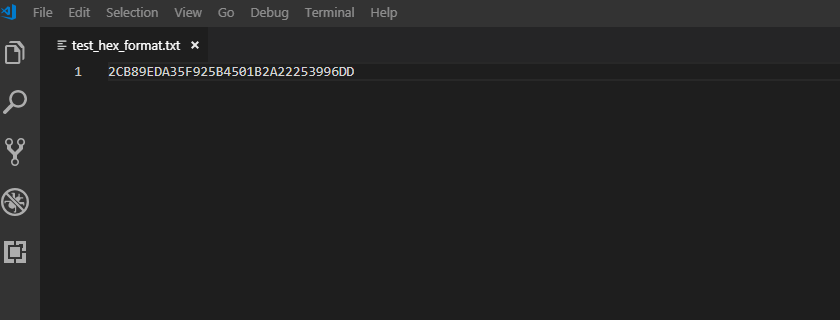

# hex-array-formatter

VS Code extension to quickly toggle hex array presentation format between commonly used format (hex string, C array etc).

Example :
AABBCCDD => AA BB CC DD => AA:BB:CC:DD => 0xAA, 0xBB, 0xCC, 0xDD

## Features

Quickly toggle hex array presentation format between commonly used format (hex string, C array etc).

> Tip: You can use `ctr+alt+H` shortcut

